# Pharmacy Sales Chatbot - Application Architecture & Workflow

## 🏥 **System Overview**

The Pharmacy Sales Chatbot is an intelligent inbound call handling system that integrates with external APIs and AI services to provide personalized pharmacy management solutions. The system automatically identifies callers, collects information, and manages follow-up actions.

---

## 🏗️ **System Architecture**

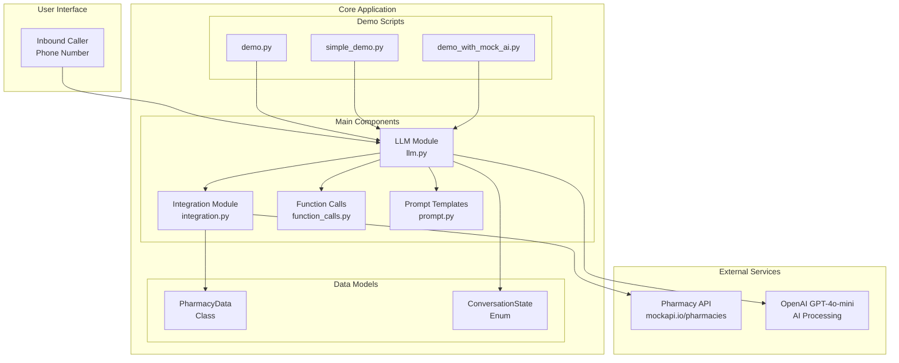

---

## 🔄 **Core Workflow**

### **1. Call Start & Phone Lookup**

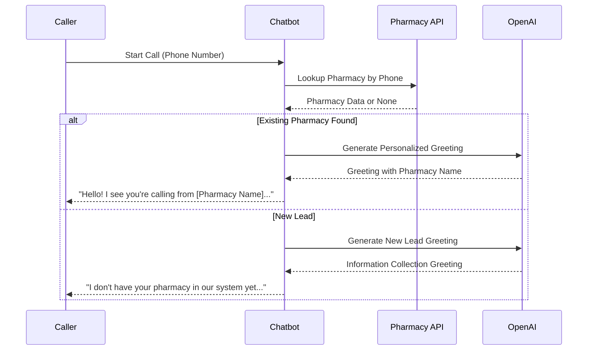

### **2. Conversation State Management**

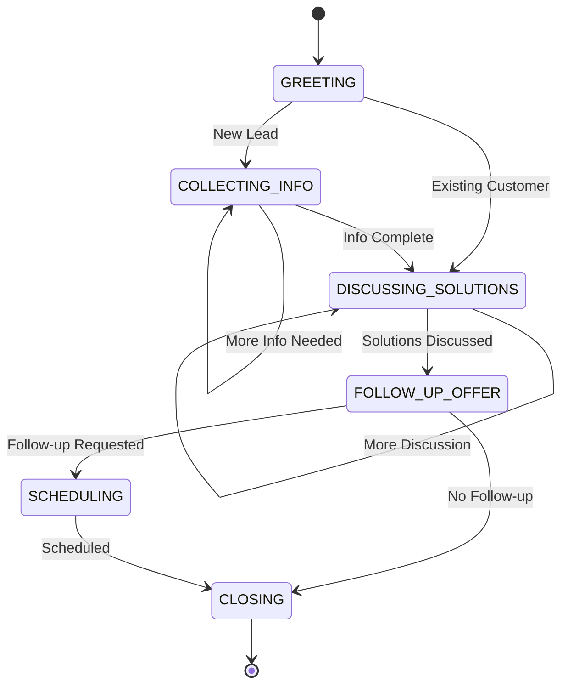

---

## 📁 **Module Breakdown**

### **1. LLM Module (`llm.py`)**

**Purpose**: Main chatbot logic and conversation management

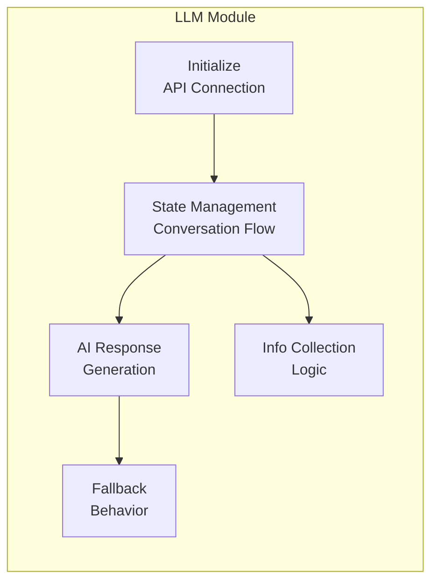

**Key Features**:

- **AI Integration**: OpenAI GPT-4o-mini for intelligent responses
- **Fallback Mode**: Works without AI when API unavailable
- **State Management**: Tracks conversation progress
- **Info Collection**: Structured data gathering for new leads

### **2. Integration Module (`integration.py`)**

**Purpose**: External API communication and data handling

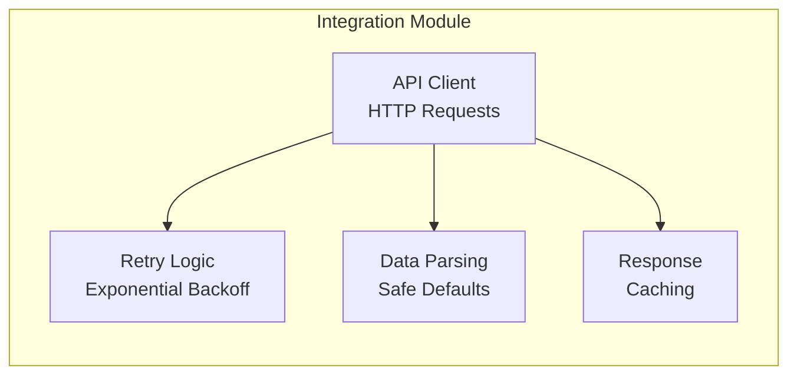

**Key Features**:

- **Robust API Calls**: Retry mechanism with exponential backoff
- **Safe Data Parsing**: Handles malformed/missing data gracefully
- **Error Recovery**: Graceful degradation on API failures
- **Response Caching**: Optimizes repeated requests

### **3. Function Calls (`function_calls.py`)**

**Purpose**: Mock follow-up actions (email, callback scheduling)

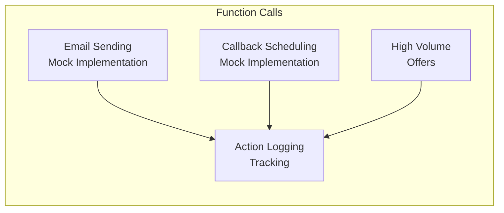

**Key Features**:

- **Mock Email System**: Simulates email sending with logging
- **Callback Scheduling**: Mock appointment booking system
- **High Volume Offers**: Special handling for large pharmacies
- **Action Tracking**: Records all follow-up activities

### **4. Prompt Templates (`prompt.py`)**

**Purpose**: Conversation templates and response formatting

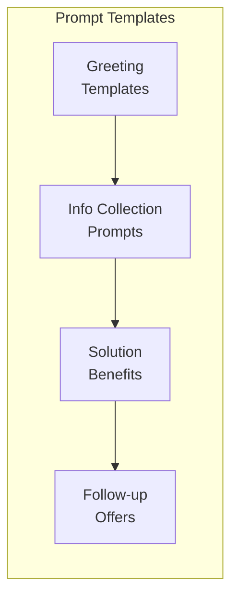

**Key Features**:

- **Dynamic Templates**: Context-aware conversation prompts
- **Volume-Based Benefits**: Different messaging for different pharmacy sizes
- **Response Templates**: Structured AI response formatting
- **State-Specific Prompts**: Tailored prompts for each conversation stage

---

## 🎯 **Key Workflows**

### **Workflow 1: Existing Customer Call**

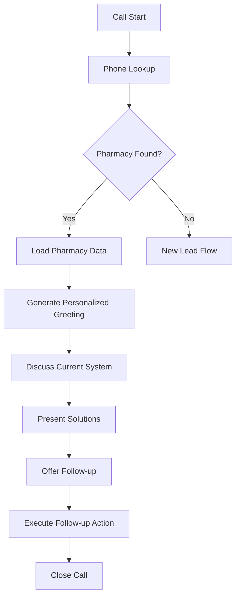

**Steps**:

1. **Phone Lookup**: Check API for existing pharmacy
2. **Data Retrieval**: Load pharmacy name, location, Rx volume
3. **Personalized Greeting**: AI-generated greeting with pharmacy details
4. **Solution Discussion**: Present relevant benefits based on Rx volume
5. **Follow-up Action**: Send email or schedule callback
6. **Call Closure**: Professional closing with next steps

### **Workflow 2: New Lead Call**

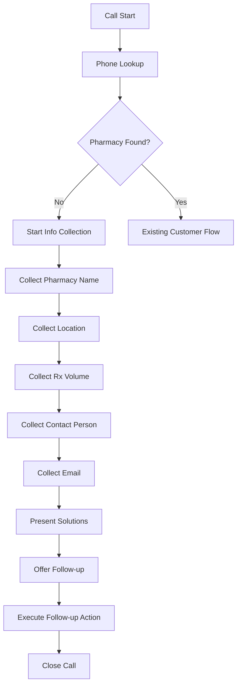

**Steps**:

1. **Phone Lookup**: Confirm new lead status
2. **Information Collection**: Structured data gathering
3. **Volume Assessment**: Determine appropriate solutions
4. **Solution Presentation**: Tailored benefits based on collected data
5. **Follow-up Action**: Send information or schedule consultation
6. **Call Closure**: Professional closing with next steps

---

## 🔧 **Technical Implementation**

### **Data Flow Architecture**

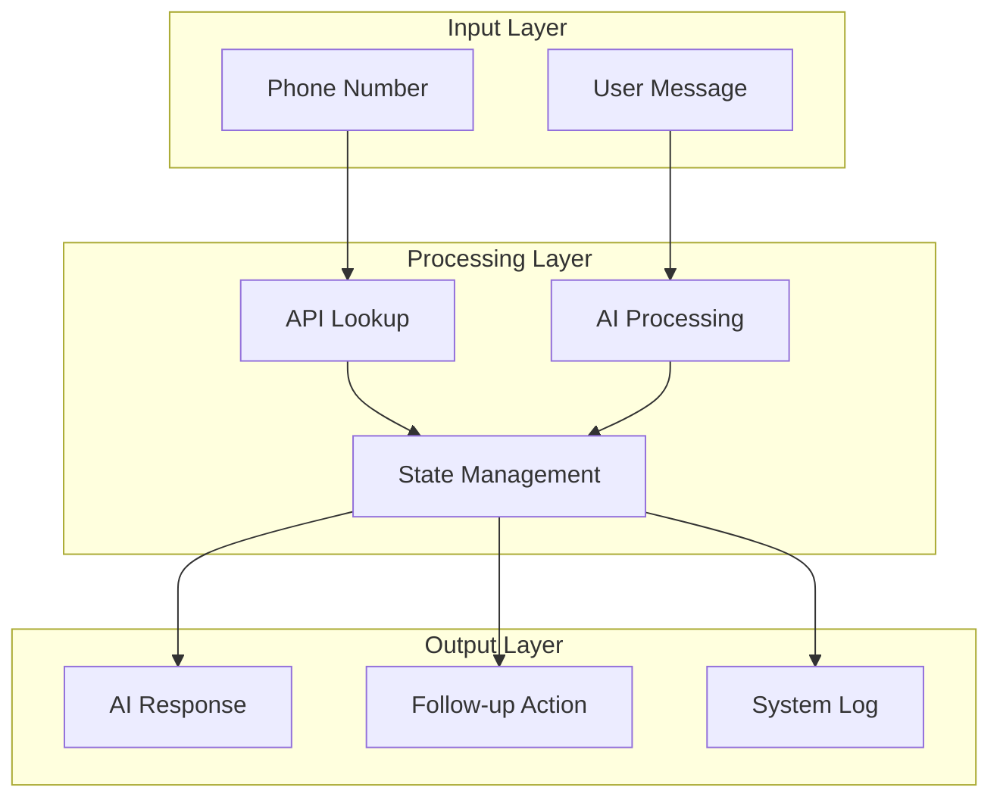

### **Error Handling & Fallback**

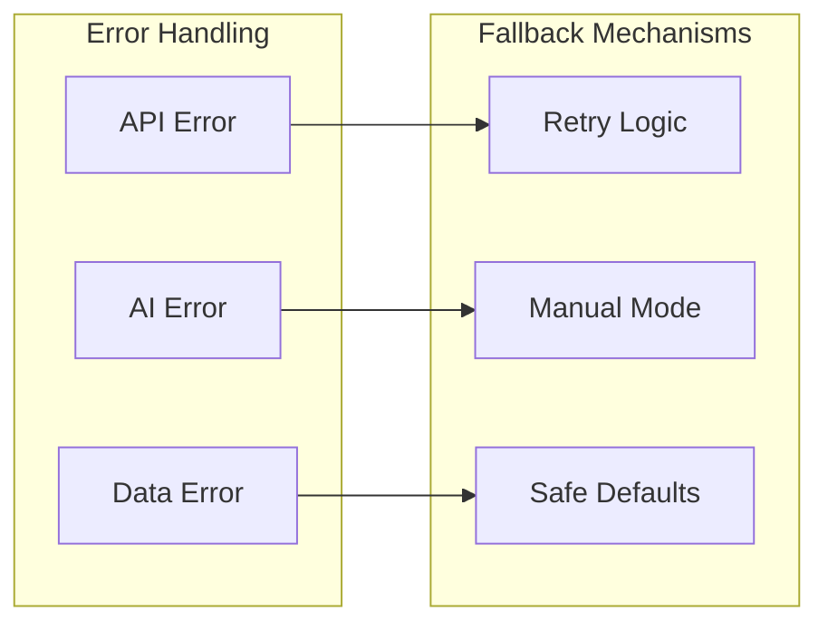

---

## 🚀 **Key Features**

### **1. Intelligent Customer Recognition**

- **API Integration**: Real-time pharmacy lookup
- **Personalized Greetings**: AI-generated context-aware responses
- **Data-Driven Conversations**: Uses actual pharmacy data

### **2. Volume-Based Solution Tailoring**

- **High Volume (1000+ Rx)**: Advanced automation, priority support
- **Standard Volume (<1000 Rx)**: Basic automation, standard support
- **Dynamic Benefits**: Real-time solution customization

### **3. Robust Error Handling**

- **API Failures**: Automatic retry with exponential backoff
- **AI Unavailability**: Graceful fallback to manual mode
- **Data Issues**: Safe defaults for missing/malformed data

### **4. Complete Follow-up Management**

- **Email System**: Mock email sending with tracking
- **Callback Scheduling**: Mock appointment booking
- **Action Logging**: Comprehensive activity tracking

### **5. Production-Ready Architecture**

- **Modular Design**: Clean separation of concerns
- **Comprehensive Logging**: Full system observability
- **Scalable Structure**: Easy to extend and maintain

---

## 📊 **System Capabilities**

| Feature               | Description                        | Status     |
| --------------------- | ---------------------------------- | ---------- |
| **Phone Lookup**      | Real-time pharmacy identification  | ✅ Working |
| **AI Integration**    | GPT-4o-mini powered conversations  | ✅ Working |
| **Fallback Mode**     | Manual operation without AI        | ✅ Working |
| **Error Recovery**    | Graceful handling of failures      | ✅ Working |
| **Follow-up Actions** | Email and callback management      | ✅ Working |
| **Volume Analysis**   | Rx volume-based solution tailoring | ✅ Working |
| **State Management**  | Complete conversation flow control | ✅ Working |
| **Data Parsing**      | Safe handling of API responses     | ✅ Working |

---

## 🎯 **Conclusion**

The Pharmacy Sales Chatbot is a **production-ready, intelligent system** that:

- ✅ **Automatically identifies** existing vs new customers
- ✅ **Provides personalized** solutions based on pharmacy data
- ✅ **Handles errors gracefully** with robust fallback mechanisms
- ✅ **Manages complete** follow-up workflows
- ✅ **Scales efficiently** with modular architecture
- ✅ **Integrates seamlessly** with external APIs and AI services

The system demonstrates **enterprise-grade reliability** while maintaining **user-friendly simplicity** and **extensive customization capabilities**.
