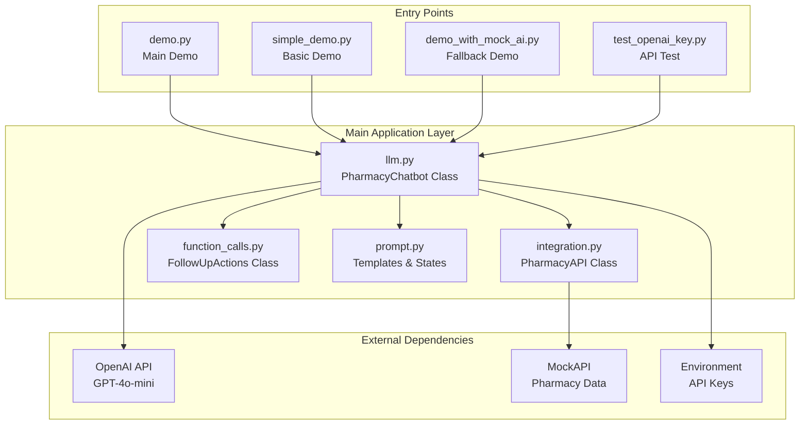
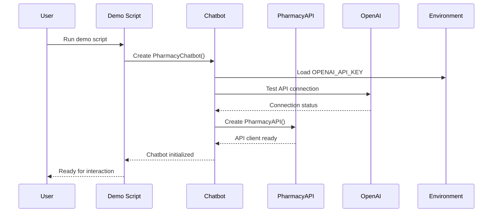
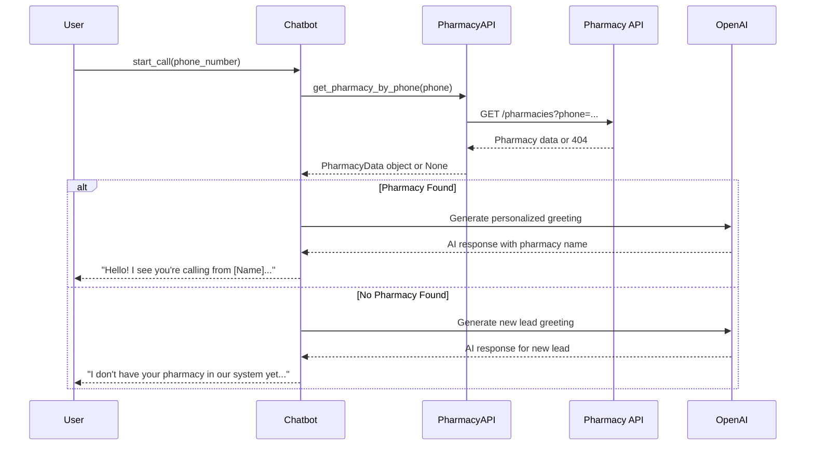
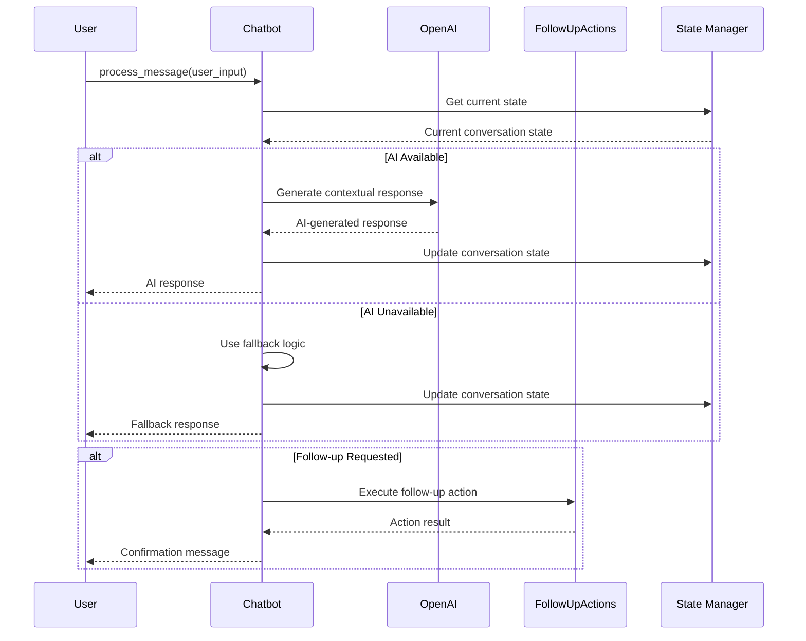
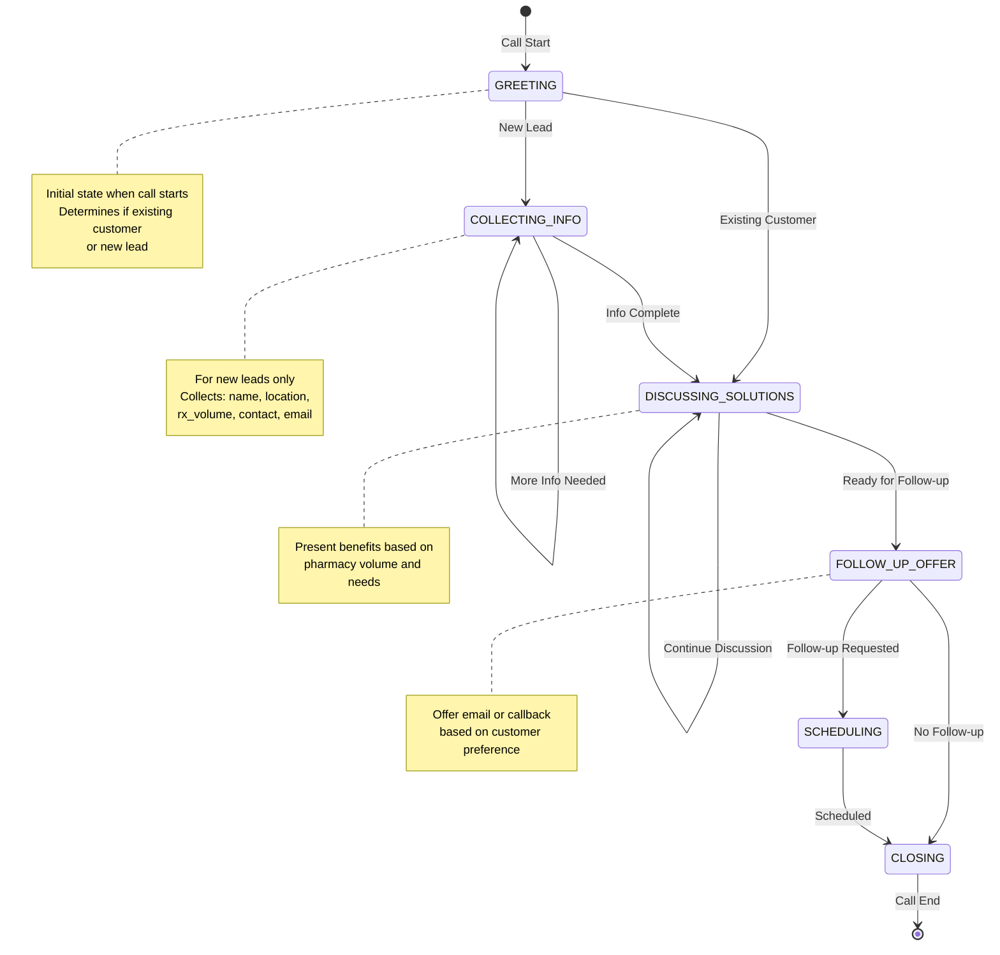
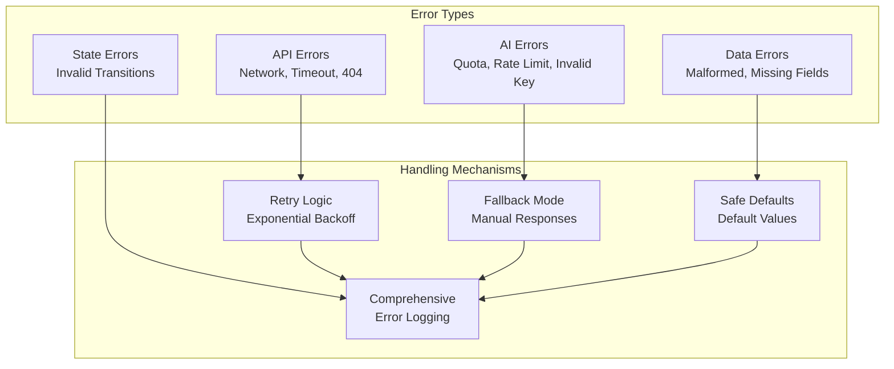
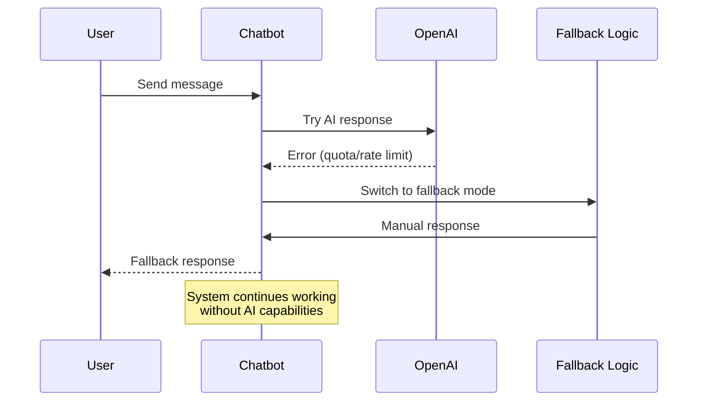

# Pharmacy Sales Chatbot - Component Details & Code Flow

## 🔧 **Detailed Component Architecture**

### **Core Component Interactions**



---

## 📋 **Detailed Code Flow**

### **1. Application Initialization Flow**



### **2. Call Start & Phone Lookup Flow**



### **3. Conversation Processing Flow**



---

## 🏗️ **Module Deep Dive**

### **1. LLM Module (`llm.py`) - Core Logic**

```python
class PharmacyChatbot:
    def __init__(self, api_key=None):
        # Initialize AI connection
        # Set up pharmacy API
        # Initialize conversation state

    def start_call(self, phone_number):
        # Lookup pharmacy by phone
        # Generate appropriate greeting
        # Set initial conversation state

    def process_message(self, user_message):
        # Route based on current state
        # Generate AI or fallback response
        # Update conversation state
        # Execute follow-up actions if needed
```

**Key Methods**:

- `start_call()`: Initial call handling and pharmacy identification
- `process_message()`: Main conversation processing logic
- `_handle_info_collection()`: New lead information gathering
- `_handle_solution_discussion()`: Solution presentation logic
- `_handle_follow_up_offer()`: Follow-up action management
- `_generate_ai_response()`: AI-powered response generation

### **2. Integration Module (`integration.py`) - API Handling**

```python
class PharmacyAPI:
    def __init__(self):
        # Initialize HTTP client
        # Set up retry configuration
        # Configure timeout settings

    def get_pharmacy_by_phone(self, phone):
        # Make API request with retry logic
        # Parse response safely
        # Return PharmacyData object

    def get_all_pharmacies(self):
        # Fetch all pharmacy data
        # Handle pagination if needed
        # Return list of PharmacyData objects
```

**Key Features**:

- **Retry Logic**: Exponential backoff for failed requests
- **Safe Parsing**: Graceful handling of malformed data
- **Error Recovery**: Fallback mechanisms for API failures
- **Response Caching**: Optimize repeated requests

### **3. Function Calls (`function_calls.py`) - Follow-up Actions**

```python
class FollowUpActions:
    def send_welcome_email(self, pharmacy):
        # Mock email sending
        # Log action details
        # Return success/failure status

    def schedule_consultation(self, pharmacy, time):
        # Mock callback scheduling
        # Log appointment details
        # Return confirmation status

    def send_high_volume_offer(self, pharmacy):
        # Special high-volume pharmacy offer
        # Customized messaging
        # Action tracking
```

**Mock Implementations**:

- **Email System**: Simulates SMTP sending with logging
- **Scheduling System**: Mock calendar integration
- **Action Tracking**: Comprehensive logging of all activities

### **4. Prompt Templates (`prompt.py`) - Conversation Management**

```python
class PromptTemplates:
    @staticmethod
    def format_greeting(pharmacy_data=None):
        # Generate personalized or generic greeting

    @staticmethod
    def get_info_collection_prompt(field):
        # Get appropriate prompt for data collection

class ResponseTemplates:
    @staticmethod
    def get_solution_benefits(rx_volume):
        # Return volume-appropriate benefits

class ConversationState(Enum):
    # Define conversation flow states
```

**Template System**:

- **Dynamic Greetings**: Context-aware initial messages
- **State-Specific Prompts**: Tailored prompts for each conversation stage
- **Volume-Based Benefits**: Different messaging for different pharmacy sizes

---

## 🔄 **State Machine Details**

### **Conversation State Transitions**



### **State-Specific Logic**

| State                    | Purpose                   | Key Logic                             | Next States                           |
| ------------------------ | ------------------------- | ------------------------------------- | ------------------------------------- |
| **GREETING**             | Initial call handling     | Phone lookup, pharmacy identification | COLLECTING_INFO, DISCUSSING_SOLUTIONS |
| **COLLECTING_INFO**      | New lead data gathering   | Structured information collection     | DISCUSSING_SOLUTIONS                  |
| **DISCUSSING_SOLUTIONS** | Solution presentation     | Volume-based benefit discussion       | FOLLOW_UP_OFFER                       |
| **FOLLOW_UP_OFFER**      | Follow-up action offering | Email/callback options                | SCHEDULING, CLOSING                   |
| **SCHEDULING**           | Action execution          | Execute follow-up actions             | CLOSING                               |
| **CLOSING**              | Call conclusion           | Professional closing                  | End                                   |

---

## 🛡️ **Error Handling Architecture**

### **Error Types & Handling**



### **Fallback Behavior**



---

## 📊 **Data Flow Examples**

### **Example 1: Existing Customer Call**

```mermaid
flowchart TD
    A[Phone: +1-555-123-4567] --> B[API Lookup]
    B --> C[Found: HealthFirst Pharmacy]
    C --> D[Load: Name, Location, Rx Volume]
    D --> E[AI: Generate Personalized Greeting]
    E --> F[User: "We need help with our system"]
    F --> G[AI: "I understand you need assistance..."]
    G --> H[User: "Yes, send us information"]
    H --> I[Execute: Send Email]
    I --> J[Close: Professional Closing]
```

### **Example 2: New Lead Call**

```mermaid
flowchart TD
    A[Phone: +1-555-999-9999] --> B[API Lookup]
    B --> C[Not Found: New Lead]
    C --> D[AI: "I don't have your pharmacy..."]
    D --> E[User: "My pharmacy is Sunset Pharmacy"]
    E --> F[AI: "Where is your pharmacy located?"]
    F --> G[User: "San Diego"]
    G --> H[AI: "How many prescriptions..."]
    H --> I[User: "About 800"]
    I --> J[AI: "Who should I speak with..."]
    J --> K[User: "Sarah Johnson, manager"]
    K --> L[AI: "What's your email..."]
    L --> M[User: "sarah@sunsetpharmacy.com"]
    M --> N[AI: Present Solutions]
    N --> O[User: "Send us information"]
    O --> P[Execute: Send Email]
    P --> Q[Close: Professional Closing]
```

---

## 🎯 **Key Implementation Details**

### **1. AI Integration Strategy**

- **Model Selection**: GPT-4o-mini for optimal performance/cost
- **Prompt Engineering**: Context-aware prompts for each state
- **Response Parsing**: Structured response handling
- **Error Recovery**: Graceful fallback when AI unavailable

### **2. API Integration Strategy**

- **Retry Logic**: Exponential backoff for reliability
- **Data Validation**: Safe parsing with defaults
- **Caching**: Optimize repeated requests
- **Error Handling**: Comprehensive error recovery

### **3. State Management Strategy**

- **Enum-Based States**: Clear state definitions
- **Transition Logic**: Controlled state changes
- **Context Preservation**: Maintain conversation context
- **Error Recovery**: Handle invalid state transitions

### **4. Follow-up Action Strategy**

- **Mock Implementation**: Simulate real actions
- **Action Tracking**: Comprehensive logging
- **Flexible Actions**: Email, callback, special offers
- **Result Handling**: Success/failure reporting

This detailed architecture ensures the system is **robust, scalable, and production-ready** while maintaining **simplicity and reliability**.
